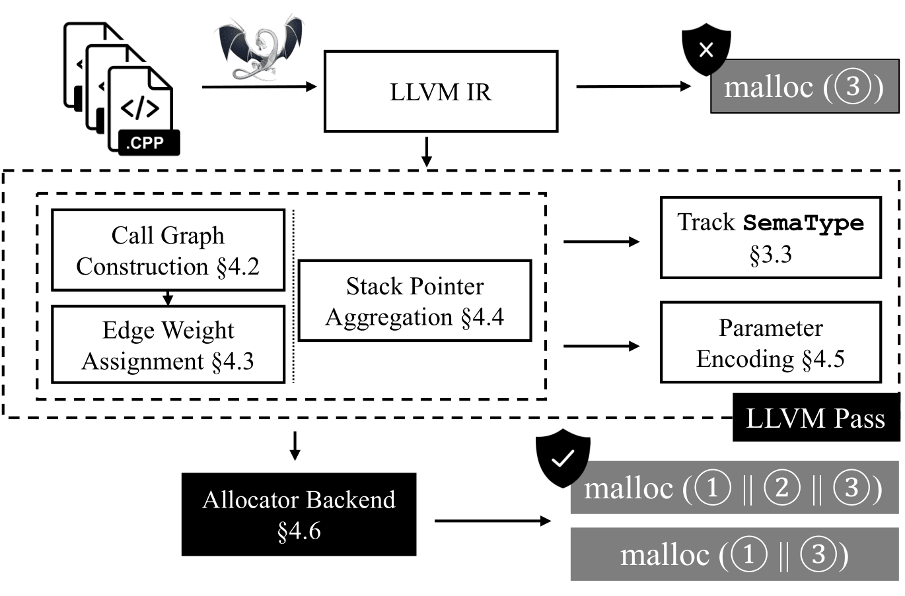

# SEMalloc:Semantics-Informed Memory Allocator



## Quick Start

SeMalloc is composed of a LLVM pass and a runtime allocation wrapper. Run the following command for a clean SeMalloc 
installation.

```
docker build -t semalloc -f Dockerfile.base .
```

To build a program:

```
./test/build.rb BUILD_CMD

// For example
cd ./test
./build.rb make
```

To convert the built program with SeMalloc pass:
```
./test/convert.rb EXE_FILE LINKER_CMD

// For example
cd ./test
./convert.rb test.run
```

To run the converted program:
```
LD_PRELOAD=/PATH/TO/libsemalloc.so EXE_FILE.out
```

## Reproduce

We provide three docker files for the evaulation of the SPEC, PARSEC, and other (for mimalloc and real-world programs) benchmarks. 
Below, we provide instructions to set up each benchmark.
Please note that three allocators (DangZero, Type-After-Type, and MineSweeper) are not included in the set up scripts, please refer to the instructions in their official repositories.
We also provide set up tips below.

### SPEC

SPEC is not used for free, while each academic institution is only charged with $50. You may contact with [SPEC](https://www.spec.org/cpu2017/) to inquiry about the personnal who has purchased it within your instute.

After you have obtained it, replace `Line 63` of `Dockerfile.spec` with a link to your copy.

Now, set up the environment:

```
docker build -t spec -f Dockerfile.spec .
```

Run the container:
```
docker run --name spec -dt spec
```

Dive into the container:

```
docker exec -it spec /bin/bash
```

Compile the benchmarks:

```
cd /app/spec
source shrc
python3 /app/semalloc/benchmarks/assets/spec_build_1.py
/app/semalloc/benchmarks/assets/spec_build_2.rb
```

Run the benchmarks:

Please set the `cmd` variable in the `make_curl` function if you want to upload the log. 
Otherwise, please comment out the call to `make_curl` in the `profile` function.

```
python3 /app/semalloc/benchmarks/assets/spec_run.py
```

### PARSEC

Set up the environment:

```
docker build -t parsec -f Dockerfile.parsec .
```

Run the container:
```
docker run --name parsec -dt parsec
```

Dive into the container:

```
docker exec -it parsec /bin/bash
```

Please set the `cmd` variable in the `make_curl` function if you want to upload the log. 
Otherwise, please comment out the call to `make_curl` in the `profile` function.

Run the benchmarks:
```
python3 /app/semalloc/benchmarks/assets/parsec_run.py
```

### MiMalloc

Set up the environment:

```
docker build -t other -f Dockerfile.other .
```

Run the container:
```
docker run --name other -dt other
```

Dive into the container:

```
docker exec -it other /bin/bash
```

Please set the `cmd` variable in the `make_curl` function if you want to upload the log. 
Otherwise, please comment out the call to `make_curl` in the `profile` function.

Run the benchmarks:
```
python3 /app/semalloc/benchmarks/assets/mimalloc_run.py
```

### Real-World Programs

You may use the scripts provided in the quick start to build these programs.

#### Install Redis:

Download and unzip `https://download.redis.io/releases/redis-6.2.7.tar.gz`
Run
```
CC=wllvm LLVM_COMPILER=clang LLVM_COMPILER_PATH="/app/llvm15/build/bin" CFLAGS="-Xclang -no-opaque-pointers -Xclang -mno-constructor-aliases" USE_JEMALLOC=no MALLOC=libc BUILD_TLS=no make -j 32`
```

Now, convert the program (see below).

#### Install Nginx:

```
git clone https://github.com/nginx/nginx.git /app/nginx
cd /app/nginx
git checkout branches/stable-1.24
```

You probably need to install `libpcre3-dev` or `libpcre2-8-dev`.

```
CC=wllvm LLVM_COMPILER=clang LLVM_COMPILER_PATH="/app/llvm15/build/bin" CFLAGS="-Xclang -no-opaque-pointers -Xclang -mno-constructor-aliases" ./auto/configure
make
```

Now, convert the program (see below).

#### Install Lighttpd:

Download and unzip `https://download.lighttpd.net/lighttpd/releases-1.4.x/lighttpd-1.4.71.tar.gz` to `/app/light`.

You probably need to install `libpcre2-posix3 libpcre2-dev`.

Create `src/plugin-static.h` file with

```
PLUGIN_INIT(mod_indexfile)
PLUGIN_INIT(mod_staticfile)
```

Run 
```
CC=wllvm LLVM_COMPILER=clang LLVM_COMPILER_PATH="/app/llvm15/build/bin" CFLAGS="-Xclang -no-opaque-pointers -Xclang -mno-constructor-aliases" ./autogen.sh
CC=wllvm LLVM_COMPILER=clang LLVM_COMPILER_PATH="/app/llvm15/build/bin" CFLAGS="-Xclang -no-opaque-pointers -Xclang -mno-constructor-aliases" LIGHTTPD_STATIC=yes ./configure -C --enable-static=yes
make
make install
```

Now, convert the program (see below).

#### Convert the program:

Link flags:
* `Nginx`: `-ldl -lpthread -lcrypt -lpcre -lz -lpcre2-8` (or pcre3)
* `Redis`: `-lm -ldl -pthread -lrt -std=c99`
* `Light`: `-lcrypt -lpcre2-8 -lz -ldl`

Use the provided scripts to build and convert:
```
./test/build.rb BUILD_CMD
./test/convert.rb EXE_FILE LINKER_CMD
```

Or manually use the commands below:
```
CC=wllvm LLVM_COMPILER=clang LLVM_COMPILER_PATH="/app/llvm15/build/bin" extract-bc EXE_FILE
CC=wllvm LLVM_COMPILER=clang LLVM_COMPILER_PATH="/app/llvm15/build/bin" /app/frontend/build/lib/kanalyzer EXE_FILE.bc
CFLAGS="-Xclang -no-opaque-pointers -Xclang -mno-constructor-aliases" /app/llvm15/build/bin/clang EXE_FILE.bc -L/app/semalloc/frontend/build/lib/ -lBuildSupport LINK_FLAGS -o /app/test/input/EXE_FILE.regular")
CFLAGS="-Xclang -no-opaque-pointers -Xclang -mno-constructor-aliases" /app/llvm15/build/bin/clang /app/semalloc/test/input/output.bc -L/app/semalloc/frontend/build/lib/ -lBuildSupport LINK_FLAGS -o /app/test/input/EXE_FILE.out")
```

#### Run Nginx

Server programs require Apache-Bench (ab) to generate requests. To install
```
apt-get install apache2-utils
```

To run the Nginx, you first need to provide a config
```
daemon            off;
worker_processes  1;
user              www-data;

events {
    use           epoll;
    worker_connections  128;
}

error_log         logs/error.log info;

http {
    server_tokens off;
    charset       utf-8;

    access_log    logs/access.log  combined;

    server {
        listen 18188 default_server;
        location / {
            index index.html;
            root /app/pages;
        }
    }

}
```
Note that you might want to change the port to be something else (already change to 18188) to avoid permission issues.

To run Nginx, use the following command
```
nginx -t /PATH/TO/CONFIG
```

#### Run Light

To run Light, you also need to provide a config:
```
server.document-root = "/app/pages/" 

server.port = 18188

server.username = "www" 
server.groupname = "www" 

mimetype.assign = (
  ".html" => "text/html", 
  ".txt" => "text/plain",
  ".jpg" => "image/jpeg",
  ".png" => "image/png" 
)

static-file.exclude-extensions = ( ".fcgi", ".php", ".rb", "~", ".inc" )
index-file.names = ( "index.html" )
```

As said above, you might also want to change the port.

Light does not come with a default page so you need to provide one:
```
<!DOCTYPE html>
<html>
<head>
<title>Welcome to nginx!</title>
<style>
    body {
        width: 35em;
        margin: 0 auto;
        font-family: Tahoma, Verdana, Arial, sans-serif;
    }
</style>
</head>
<body>
<h1>Welcome to nginx!</h1>
<p>If you see this page, the nginx web server is successfully installed and
working. Further configuration is required.</p>

<p>For online documentation and support please refer to
<a href="http://nginx.org/">nginx.org</a>.<br/>
Commercial support is available at
<a href="http://nginx.com/">nginx.com</a>.</p>

<p><em>Thank you for using nginx.</em></p>
</body>
</html>
```

In the first run, you need to create the user group:
```
useradd www
```

To run Light, using the following command:
```
lighttpd -D -f /PATH/TO/CONFIG &
```

Use the following command to run ab:
```
ab -n 100000 -c 500 http://localhost:18188/index.html
```
Note that you might want to change the port if you have modified the configs above.

#### Run Redis

Run the server:
```
./redis-server
```

Run the benchmark:
```
./redis-benchmark -r 1000000 -n 100000 -q -P 16 lpush a 1 2 3 4 5 lrange a 1 5
```

Clean cache:
```
rm dump.rdp
```

#### Troubleshooting

If you experience any permission issue or unexpected program crush, try one of the following:
* Executing the program in super user mode (i.e., `sudo su`);
* Change the server port to avoid the permission issue;
* Grant super user permission to the program only (i.e., `sudo ./EXEC`)
* Do not forget to provide the run-time library (i.e., use `LD_PRELOAD`)

### Type-After-Type

Please follow the instructions in their [official repository](https://github.com/vusec/type-after-type).
You might want to follow the instructions below to modify their scripts a bit:

First, follow their instructions except from the last line.

Now, go to `autosetup.sh` and comment out Line 140 to 170. They are very likely to be uncompatible to your machine.

Here, we have two main tasks: install libunwind and llvm.

To install libunwind, please refer to their [official repository](https://github.com/libunwind/libunwind).

LLVM contains several parts: LLVM, Clang, Openmp, and LLVM-Gold.

First, update `autosetup/packages/llvm.inc` Line 3 to line 7 to have the correct LLVM:
```
git clone "https://github.com/llvm/llvm-project"
cd "llvm-project"
git checkout "llvmorg-4.0.0"
```

Note that the layout of the downloaded repo is different the repo they used.
Specifically, you need to install LLVM, Clang, OpenMP and Gold individually.

Simply go to the subdirectories of `LLVM` and `Clang` and run the commands provided in `autosetup/packages/llvm.inc` to compile and install them.

Alternatively, the following script might be found helpful:
```
run mkdir -p "$PATHAUTOPACKOBJ/llvm-$VERSIONLLVMPATCH"
cd "$PATHAUTOPACKOBJ/llvm-$VERSIONLLVMPATCH"
run cmake -DCMAKE_INSTALL_PREFIX="$PATHAUTOPREFIX" -DCMAKE_BUILD_TYPE=Release -DLLVM_ENABLE_ASSERTIONS=ON -DLLVM_BINUTILS_INCDIR="$PATHBINUTILS/include" "$llvmdir/llvm-project-llvmorg-4.0.0/llvm"
run make -j1
run make install

run mkdir -p "$PATHAUTOPACKOBJ/clang-$VERSIONLLVMPATCH"
cd "$PATHAUTOPACKOBJ/clang-$VERSIONLLVMPATCH"
run cmake -DCMAKE_INSTALL_PREFIX="$PATHAUTOPREFIX" -DCMAKE_BUILD_TYPE=Release -DLLVM_ENABLE_ASSERTIONS=ON -DLLVM_BINUTILS_INCDIR="$PATHBINUTILS/include" "$llvmdir/llvm-project-llvmorg-4.0.0/clang"
run make -j1
run make install

run mkdir -p "$PATHAUTOPACKOBJ/openmp-$VERSIONLLVMPATCH"
cd "$PATHAUTOPACKOBJ/openmp-$VERSIONLLVMPATCH"
run cmake -DCMAKE_INSTALL_PREFIX="$PATHAUTOPREFIX" -DCMAKE_BUILD_TYPE=Release -DLLVM_ENABLE_ASSERTIONS=ON -DLLVM_BINUTILS_INCDIR="$PATHBINUTILS/include" "$llvmdir/llvm-project-llvmorg-4.0.0/openmp"
run make -j16
run make install
```

During compilcation, exceptions might be thrown, you need to remove the additional parameters in the LLVM source code to fix them:

```
Description: Fix lambda parameter redeclaration bugs in clang source code
 /tmp/llvm-3.9.1.src/tools/clang/lib/CodeGen/CGOpenMPRuntime.cpp: In lambda function:
 /tmp/llvm-3.9.1.src/tools/clang/lib/CodeGen/CGOpenMPRuntime.cpp:6078:55: error: lambda parameter ‘CGF’ previously declared as a capture
  6078 |                          &NumOfPtrs](CodeGenFunction &CGF, PrePostActionTy &) {
       |                                      ~~~~~~~~~~~~~~~~~^~~
 /tmp/llvm-3.9.1.src/tools/clang/lib/CodeGen/CGOpenMPRuntime.cpp: In lambda function:
 /tmp/llvm-3.9.1.src/tools/clang/lib/CodeGen/CGOpenMPRuntime.cpp:6126:53: error: lambda parameter ‘CGF’ previously declared as a capture
  6126 |                        &NumOfPtrs](CodeGenFunction &CGF, PrePostActionTy &) {
       |                                    ~~~~~~~~~~~~~~~~~^~~
 /tmp/llvm-3.9.1.src/tools/clang/lib/CodeGen/CGOpenMPRuntime.cpp: In lambda function:
 /tmp/llvm-3.9.1.src/tools/clang/lib/CodeGen/CGOpenMPRuntime.cpp:6191:56: error: lambda parameter ‘CGF’ previously declared as a capture
  6191 |   auto &&ThenGen = [&D, &CGF, Device](CodeGenFunction &CGF, PrePostActionTy &) {
       |                                       ~~~~~~~~~~~~~~~~~^~~
 This bug cause compiler error when clang 9.0.0 is used, because lambda parameter of which the name is the same as the one of capture
 is no longer allowed.
Author: Sun Ziping <sunziping2016@gmail.com>
Last-Update: 2019-12-18

diff -ur a/tools/clang/lib/CodeGen/CGOpenMPRuntime.cpp b/tools/clang/lib/CodeGen/CGOpenMPRuntime.cpp
--- a/tools/clang/lib/CodeGen/CGOpenMPRuntime.cpp	2016-06-24 12:05:48.000000000 +0800
+++ b/tools/clang/lib/CodeGen/CGOpenMPRuntime.cpp	2019-12-18 19:26:11.727652326 +0800
@@ -6073,7 +6073,7 @@
   // Generate the code for the opening of the data environment. Capture all the
   // arguments of the runtime call by reference because they are used in the
   // closing of the region.
-  auto &&BeginThenGen = [&D, &CGF, &BasePointersArray, &PointersArray,
+  auto &&BeginThenGen = [&D, &BasePointersArray, &PointersArray,
                          &SizesArray, &MapTypesArray, Device,
                          &NumOfPtrs](CodeGenFunction &CGF, PrePostActionTy &) {
     // Fill up the arrays with all the mapped variables.
@@ -6121,7 +6121,7 @@
   };

   // Generate code for the closing of the data region.
-  auto &&EndThenGen = [&CGF, &BasePointersArray, &PointersArray, &SizesArray,
+  auto &&EndThenGen = [&BasePointersArray, &PointersArray, &SizesArray,
                        &MapTypesArray, Device,
                        &NumOfPtrs](CodeGenFunction &CGF, PrePostActionTy &) {
     assert(BasePointersArray && PointersArray && SizesArray && MapTypesArray &&
@@ -6188,7 +6188,7 @@
          "Expecting either target enter, exit data, or update directives.");

   // Generate the code for the opening of the data environment.
-  auto &&ThenGen = [&D, &CGF, Device](CodeGenFunction &CGF, PrePostActionTy &) {
+  auto &&ThenGen = [&D, Device](CodeGenFunction &CGF, PrePostActionTy &) {
     // Fill up the arrays with all the mapped variables.
     MappableExprsHandler::MapValuesArrayTy BasePointers;
     MappableExprsHandler::MapValuesArrayTy Pointers;
@@ -6592,4 +6592,3 @@
   }
   CGF.EmitRuntimeCall(RTLFn, Args);
 }
-
```

Use this instruction to install [Gold](https://llvm.org/docs/GoldPlugin.html).

You might also experience difficulty installing TCMalloc, use the [official instruction](https://github.com/gperftools/gperftools) instead.

Now, you have Type-After-Type installed, it is time to compile programs and run programs with it.

There should be two files `./run-firefox-tat-heap-inline.sh` and `./build-firefox-tat-heap-inline.sh`, and also two files `./run-firefox-baseline-lto.sh` and `./build-firefox-baseline-lto.sh`. All other generated configs are irrelevant. 

Use the scripts in these files to compile and run programs.

### DangZero

To start, please follow the instructions in their [official repository](https://github.com/vusec/dangzero).

It is highly recommended to use a physical machine or forward X over SSH to have GUI.
You may not have DangZero installed without GUI.

During the installation of DangZero, an error might be thrown, you may ignore it.

We also recommend the following Qemu parameters in the final step:
```
qemu-system-x86_64 -drive "file=ubuntu.img,format=qcow2" -enable-kvm -m 8G -smp 16 -cpu host,-pdpe1gb -nographic -serial mon:stdio -net nic -net user,hostfwd=tcp::1810-:22
```

### MineSweeper
Simply follow the instructions in their official [repository](https://github.com/EMarci15/asplos22-minesweeper-reproduce) to install.

## Credits

This work is built on [MLTA](https://github.com/umnsec/mlta) and [CXXGraph](https://github.com/ZigRazor/CXXGraph).

Their corresponding licenses are provided.
